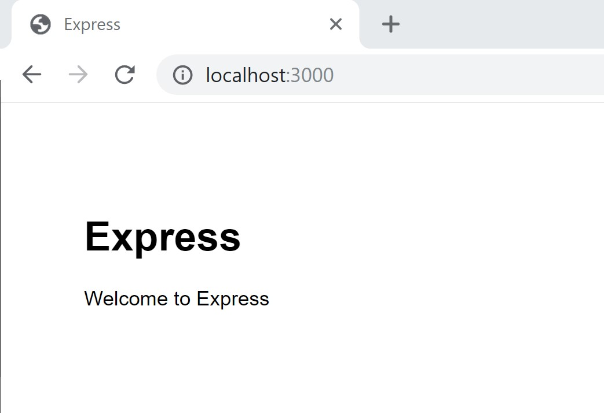

# Building a Mainframe web application using Zowe CLI

## Background

[Zowe](https://www.zowe.org/) is an open source project created to host technologies that benefit the Z platform from all members of the Z community (Integrated Software Vendors, System Integrators and z/OS consumers). Zowe, like Mac OS or Windows, comes with a set of APIs and OS capabilities that applications build on and also includes some applications out of the box.

Zowe offers modern interfaces to interact with z/OS and allows you to work with z/OS in a way that is similar to what you experience on cloud platforms today. You can use these interfaces as delivered or through plug-ins and extensions that are created by clients or third-party vendors.

Zowe consists of the following main components.

**Zowe Application Framework**: A web user interface (UI) that provides a virtual desktop containing a number of apps allowing access to z/OS function. Base Zowe includes apps for traditional access such as a 3270 terminal and a VT Terminal, as well as an editor and explorers for working with JES, MVS Data Sets and Unix System Services.

**API Mediation Layer**: Provides a gateway that acts as a reverse proxy for z/OS services, together with a catalog of REST APIs and a dynamic discovery capability. Base Zowe provides core services for working with MVS Data Sets, JES, as well as working with z/OSMF REST APIs. The API Mediation Layer also provides a framework for Single Sign On (SSO).

**Zowe CLI**: Provides a command-line interface that lets you interact with the mainframe remotely and use common tools such as Integrated Development Environments (IDEs), shell commands, bash scripts, and build tools for mainframe development. It provides a set of utilities and services for application developers that want to become efficient in supporting and building z/OS applications quickly. The CLI provides a core set of commands for working with data sets, USS, JES, as well as issuing TSO and console commands.

--- 

This is the official presentation that you would find on the aforementioned link. What I find really interesting is the fact that the CLI component offers a *set of utilities and services* that can help us build z/OS applications quickly. And this is the aspect I want to explore here.

## Zowe CLI

The name says it all. It's a CLI application that is meant to give users an off-platform way to interact with the mainframe. Since I am using this almost on a daily basis, I can say this aspect works great. 

In more technical terms, Zowe CLI is a Node.js application written in TypeScript, that is using z/OS REST APIs (served by z/OSMF) to communicate with the mainframe.

Some of the capabilities of the CLI are:
- **file management**: create, edit, download, and upload mainframe files (data sets and unix files)
- **submit jobs**: submit [JCL](https://en.wikipedia.org/wiki/Job_Control_Language) from data sets of local storage, monitor the status or view and download the output
- **issue TSO and z/OS console commands**

For a full set of capabilities, please see the [docs](https://docs.zowe.org/stable/user-guide/cli-usingcli.html#zowe-cli-command-groups).

With that being said, I want to draw attention to the way how the application is structured. If we check the github [repository](https://github.com/zowe/zowe-cli), we notice that each command group is split in two parts (example [here](https://github.com/zowe/zowe-cli/tree/master/packages/zosmf/src)).

- A CLI part:  
    That contains the front-end of the application (what we see in the console, when we use it)

- and an API part:  
    that holds the method implementations for each command.  

    > This is the part that we want to explore!

### Without further ado, let's jump right in, and start building our Mainframe Web Application. 

## Pre-requisites

Since this is a Node.js application, we need of course Node.js installed.
Go ahead to https://nodejs.org/en/ and install the LTS version for your OS. Make sure you also install **npm** in the process.

## Building our application

Go ahead and create a folder that will contain the source code, and navigate to it:

```
$ mkdir mymainframeapp  
$ cd mymainframeapp
```

Now let's build our application skeleton. For that, I've chosen [Express.js](https://expressjs.com/) as my web framework.
```
$ npx express-generator --view=pug
```
> **npx** comes with Node.js v 8.2.0 or higher. If you don't have it, please follow [this](https://expressjs.com/en/starter/generator.html) to install and use **express-generator**.  
  
> I am using Pug as my HTML template engine, but Express.js knows how to work with any number of them. If you are familiar with another one, feel free to use it. Full list [here](https://github.com/expressjs/express/wiki#template-engines).

Output should look like this:

```
npx: installed 10 in 2.661s
destination is not empty, continue? [y/N] y

   create : public\
   create : public\javascripts\
   create : public\images\
   create : public\stylesheets\
   create : public\stylesheets\style.css
   create : routes\
   create : routes\index.js
   create : routes\users.js
   create : views\
   create : views\error.pug
   create : views\index.pug
   create : views\layout.pug
   create : app.js
   create : package.json
   create : bin\
   create : bin\www

   run the app:
     > SET DEBUG=zowe-webapp:* & npm start
```

> You may or may not see the warning regarding the folder not being empty. I had a README.md file from initializing it as a git repository.

After this, you need to install the dependencies:

```
npm install
```

To start your application, simply run:

```
npm start
```

And go to http://localhost:3000/ in your web browser to access it.
You should be able to see something like this:

  

Neat, huh?

## But wait!!!   

This is just a plain web application, not a *mainframe* one!

As an use-case, I will try to keep it simple. Let's say I want to check the IPL information of the system.

> IPL stands for Initial Program Load, and it's mainframe nomenclature for system boot.

In order to get this information, you need to connect to your [3270 terminal emulator](https://www.google.com/search?q=3270+emulator&rlz=1C1GCEA_enUS869US869&sxsrf=ACYBGNRHic-f5qJm8pfhTrI6n8DbhmY3gw:1570813385740&source=lnms&tbm=isch&sa=X&ved=0ahUKEwjC8PXu15TlAhXgRBUIHVO8DFYQ_AUIEigB&biw=1536&bih=722) of choice, log in with your mainframe credentials, navigate through the [ISPF panels](https://www.google.com/search?rlz=1C1GCEA_enUS869US869&biw=1536&bih=722&tbm=isch&sxsrf=ACYBGNTF7c8Axlgi18rufk-MY0redjM21A%3A1570813388017&sa=1&ei=zLWgXZ9N64KFsg-y9ozYDA&q=ISPF&oq=ISPF&gs_l=img.3..0l8j0i24l2.76269.76664..77833...0.0..0.99.319.4......0....1..gws-wiz-img.......35i39j0i67.Mr4lFrIKl4Y&ved=0ahUKEwif44Dw15TlAhVrQUEAHTI7A8sQ4dUDCAc&uact=5) and go to the system console, then issue the command `/DISPLAY IPLINFO`. Pretty lengthy activity, right?

How about we simplify this task, so that the user needs only to press a button and get this information.  

### 1. Add a button to press to request the IPL information

- the [index.pug](/views/index.pug) page is the one which is displayed by default. The landing page, if you will. 
- We do here the following:
    - add a button element
        - it has to be of `type=submit`, so it will trigger the form action
        - we tie it to the form by specfying the proper id with `form="getIplInfo"`
    - add a form element
        - the form has an `id="getIplInfo"` so that the button can call it
        - the `action="/iplinfo"` will be triggered when the button is clicked
        - the `method="GET"` is the HTTP method used to perform the action

    ```
    extends layout

    block content
    h1= title
    p Welcome to #{title}

    button(type="submit", form="getIplInfo") Get IPL Info

    form(id="getIplInfo",action="/iplinfo", method="GET")

    ```

- you should end up with a button like this on your main page:

 

- if you click it, you should get a 404 error, because the application is looking for `http://localhost:3000/iplinfo?` which is not yet defined. Let's fix that.

### 2. Add the routing

- when the button is clicked, the form action is performed, and the application is trying to perform the `GET` request on that specific page (`/iplinfo`). This behavior is defined in [index.js](/routes/index.js).

    - we define a new `get()` method for the router for that specific URL
    - inside we render the index page again and pass our `iplinfo` along with other data
    > Note that for now we use mocked IPL data, and we will come back to it later in the tutorial
    ```
    var express = require('express');
    var router = express.Router();

    /* GET home page. */
    router.get('/', function(req, res, next) {
    res.render('index', { title: 'Express' });
    });

    router.get('/iplinfo', function(req, res, next) {
    let iplinfo = "placeholder value"    // function that returns IPL INFO will be called here
    res.render('index', { title: 'Express' , output: iplinfo});
    })

    module.exports = router;
    ```

    - in order to conditionally display the additional data, we have to edit again [index.js](/routes/index.js)
    - PUG template engine has conditional statements built it, so we can safely display additional content based on the existence of a variable
    - in our case, if we pass `iplinfo` when rendering the `index` page, then the Output paragraph will be rendered as well.

    ```
    extends layout

    block content
    h1= title
    p Welcome to #{title}
    button(type="submit", form="getIplInfo") Get IPL Info
    form(id="getIplInfo",action="/iplinfo", method="GET")
    if output
        div 
        p Output:
        span #{output}
    ```

- now, when we click the button, we should see our mocked data.


### 3. Implement access to mainframe

- to be able to access the mainframe, we want to use Zowe's CLI node APIs
- in order to do that, we need to first install it:
```
npm install @zowe/cli --save
```
- this command will install it under `node_modules` folder in our application, and make sure that `package.json` is updated with `@zowe/cli` added as a dependency.

> Make sure you add `node_modules` folder in your `.gitingore`! You don't need that in your git repository.

- now that we have `zowe/cli` installed, let's create a folder named `services` that will store our application servies, and there create new file called `mainframe` where we build our function that will issue the Console command. 

```
const zowe = require('@zowe/cli');

class Mainframe {
    constructor(host, port, user, password) {
        this.profile = {
            host,
            port,
            user,
            password,
            rejectUnauthorized: false
        }
    }

    async getIplInfo(account) {
        const session = zowe.ZosmfSession.createBasicZosmfSessionFromArguments(this.profile);
        const command = `D IPLINFO`;
        const out = await zowe.IssueCommand.issueAndCollect(session, {command}, {});
        const commandResponse = out.commandResponse.split('\n');
        return commandResponse;
    }
}

module.exports = Mainframe;
```
- we've built a `Mainframe` object that takes several parameters when instantiating. Those are used to create the session needed to connect to z/OSMF (mainframe).
    - host: z/OSMF's hostname
    - port: z/OSMF's port
    - user: your mainframe username
    - password: your mainframe password
    - rejectUnauthorized: this value disables certificate validation. Since we don't use a certificate, we hard code it to `false`
- then we have a method that takes one argument, `account`, needed to run the TSO command. There are more parameters for the TSO command, but the rest have some default values, which we will take them as they are for now.
    - account: the account number that is issued to you when your mainframe account is created
- inside this method we create a `session` based on the connection details passed before
- we hard code the command to display IPL information
- we call Zowe's API to issue the TSO command, passing the needed parameters
- and finally, we parse the output and return it.

Let's do a quick restructure of our application.

- we add a `controllers` folder, to hold all of our actions for the front-end. The controllers will call the services, and in turn, the router in `index.js` will call the controllers.
- here we create an `mfController.js` with the following content:
```
const Mainframe = require ('../services/mainframe')

const host = "your_zosmf_hostname";
const port = your_zosmf_port;
const user = "your_zos_username";
const password = "your_zos_password";

const mainframe = new Mainframe(host, port, user, password);

const account = 'your_zos_account_number';

exports.getIplInfo = function(req, res, next) {
    const iplinfo = mainframe.getIplInfo(account);
    iplinfo.then(function(result) {
        res.render('index', { title: 'Express' , output: result});
    }, function(err) {
        console.log(err);
    });
}
```
- as you can see, we require our mainframe service file, and instantiate the Mainframe object we defined there
- then we create the `getIplInfo` function that is similar to what we had in the `index.js` file, and export it

Now we can go to our `index.js` file, require this specific controller, and use this function there.

```
var express = require('express');
var router = express.Router();
var mfController = require('../controllers/mfController');

/* GET home page. */
router.get('/', function(req, res, next) {
  res.render('index', { title: 'z/OS IPL INFO' });
});

router.get('/iplinfo', mfController.getIplInfo)

module.exports = router;
```
- now, our `index.js` looks cleaner.
- finally, since we get back a list of strings, let's add a loop to our `index.pug` file, to improve the output display.
```
extends layout

block content
  h1= title
  p Welcome to #{title}
  button(type="submit", form="getIplInfo") Get IPL Info
  form(id="getIplInfo",action="/iplinfo", method="GET")
  if output
    div 
      p Output:
      for line in output
        span #{line}
        br
```

### 4. Personal touches

- changed the title in `index.js` and `mfController.js` from *Express* to *z/OS IPL INFO*
- in `index.pug` changed the welcome message
---
# Extras:
## Hosting your web application

There are many hosting services for your web applications, but I've found Heroku to be one of the simplest and cheapest (even free) ways to do that.

